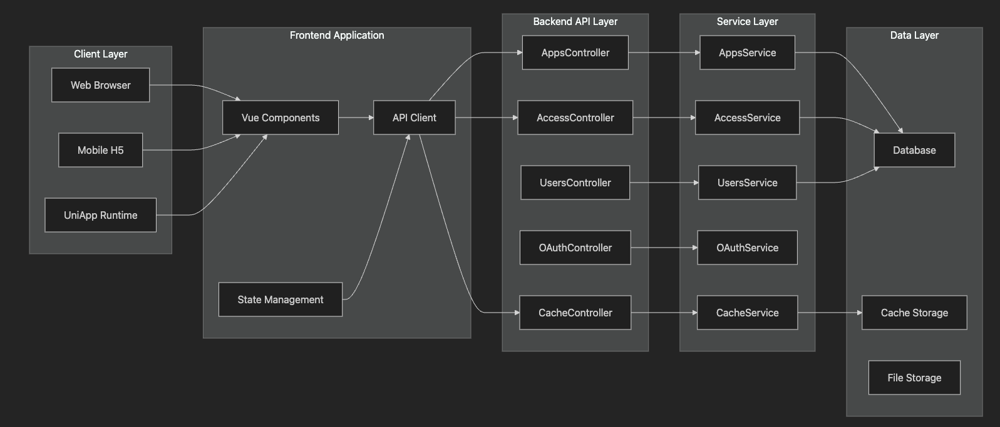

# VTJ低代码开发平台概述

## 目的和范围

本文档全面概述了VTJ低代码开发平台（LCDP），这是一个支持快速创建和部署应用程序的多平台开发环境。平台采用Vue.js前端应用与NestJS后端API架构，支持多种部署目标，包括Web浏览器、移动H5应用和跨平台UniApp环境。

本文档涵盖平台整体架构、核心技术和系统组织。

## 系统架构概述

VTJ LCDP采用现代化Web应用架构，实现前端展示层、后端服务层和多平台构建系统的清晰分离。

### 整体架构设计


### 分层架构模式

平台采用分层架构设计，各层职责明确：

1. **用户界面层**：基于Vue.js的可视化开发环境
2. **应用服务层**：NestJS实现的核心业务逻辑
3. **数据服务层**：统一API网关和微服务架构
4. **基础设施层**：容器化部署和云原生支持



## 多平台构建系统

平台支持四个核心构建目标，每个目标针对特定部署场景优化：

| 构建目标 | 环境变量            | 输出类型   | 主要应用场景  | 技术实现细节                    |
| -------- | ------------------- | ---------- | ------------- | ------------------------------- |
| main     | `BUILD_TYPE=main`   | 核心应用包 | 主Web应用部署 | 包含完整业务逻辑，支持SSR       |
| web      | `BUILD_TYPE=web`    | Web优化包  | 标准Web浏览器 | 响应式设计，PC端体验优化        |
| h5       | `BUILD_TYPE=h5`     | 移动H5包   | 移动Web应用   | 触控优化，移动端适配            |
| uniapp   | `BUILD_TYPE=uniapp` | 跨平台包   | 多端应用部署  | 编译为微信小程序、Android/iOS等 |

### 构建脚本配置说明

构建系统通过npm脚本支持环境特定配置：

```bash
# 开发环境 (热重载)
npm run dev  # ENV_TYPE=local，启动开发服务器

# SIT环境构建 (系统集成测试)
npm run sit:main     # ENV_TYPE=sit BUILD_TYPE=main
npm run sit:web      # ENV_TYPE=sit BUILD_TYPE=web
npm run sit:h5       # ENV_TYPE=sit BUILD_TYPE=h5
npm run sit:uniapp   # ENV_TYPE=sit BUILD_TYPE=uniapp

# 生产环境构建
npm run build:main     # ENV_TYPE=live BUILD_TYPE=main
npm run build:web      # ENV_TYPE=live BUILD_TYPE=web
npm run build:h5       # ENV_TYPE=live BUILD_TYPE=h5
npm run build:uniapp   # ENV_TYPE=live BUILD_TYPE=uniapp
```

## 核心技术与依赖项

### 前端核心依赖

| 包名称               | 版本范围               | 功能描述               | 技术特性               |
| -------------------- | ---------------------- | ---------------------- | ---------------------- |
| vue                  | ~3.5.0                 | 核心Vue.js框架         | 组合式API，响应式系统  |
| vue-router           | ~4.5.0                 | 客户端路由管理         | 动态路由，导航守卫     |
| @vtj/web             | latest                 | VTJ Web平台集成库      | 组件库，工具函数集     |
| @vtj/h5              | latest                 | VTJ移动H5平台适配      | 移动端组件，手势支持   |
| @vtj/uni             | latest                 | VTJ UniApp跨平台支持   | 多端适配，原生能力封装 |
| @dcloudio/uni-h5-vue | 3.0.0-4050720250324001 | UniApp H5环境Vue运行时 | H5与小程序统一运行时   |

### 开发工具链

| 工具名称   | 版本    | 功能描述            | 技术优势                   |
| ---------- | ------- | ------------------- | -------------------------- |
| @vtj/cli   | latest  | VTJ命令行工具       | 项目脚手架，代码生成       |
| @vtj/pro   | latest  | VTJ专业开发工具套件 | 可视化调试，性能分析       |
| node-ssh   | ~13.2.0 | SSH远程部署支持     | 安全连接，自动化部署       |
| vite       | ^5.0.0  | 构建工具核心        | 快速冷启动，按需编译       |
| typescript | ~5.4.0  | 类型安全支持        | 静态类型检查，高级类型特性 |

## 后端模块架构

后端采用模块化NestJS架构，包含以下核心功能模块：


### 核心模块功能说明

| 模块名称 | 主要职责         | 技术实现                  |
| -------- | ---------------- | ------------------------- |
| 应用管理 | 应用生命周期管理 | 微服务注册发现，健康检查  |
| 权限控制 | 访问授权管理     | RBAC模型，JWT认证         |
| 数据服务 | 数据持久化操作   | TypeORM，事务管理         |
| 文件存储 | 资源管理         | OSS集成，分块上传         |
| 消息队列 | 异步任务处理     | RabbitMQ，任务调度        |
| 监控告警 | 系统监控         | Prometheus，Grafana仪表盘 |
| 日志服务 | 集中式日志管理   | ELK Stack，结构化日志     |

## 开发环境配置

平台支持三种环境配置，满足不同阶段需求：

| 环境类型 | 配置标识       | 主要特点               | 适用场景           |
| -------- | -------------- | ---------------------- | ------------------ |
| 开发环境 | ENV_TYPE=local | 热重载，源码映射       | 本地开发，实时调试 |
| 测试环境 | ENV_TYPE=sit   | 完整功能验证，集成测试 | 预发布环境，QA测试 |
| 生产环境 | ENV_TYPE=live  | 性能优化，安全加固     | 线上部署，用户使用 |

### 构建配置关键技术

1. **多目标支持**：支持12种环境与平台组合配置，满足全场景需求
2. **TypeScript处理**：通过`vue-tsc`实现严格类型检查和编译
3. **环境变量注入**：使用`cross-env`实现跨平台环境变量管理
4. **构建优化**：生产环境启用代码压缩、Tree Shaking和代码分割
5. **增量构建**：开发环境支持模块热替换(HMR)，提升开发效率

VTJ低代码平台通过模块化架构和灵活的多平台构建系统，为开发者提供高效的应用开发和部署体验。
