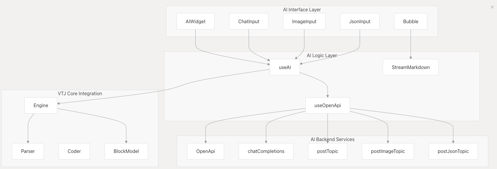
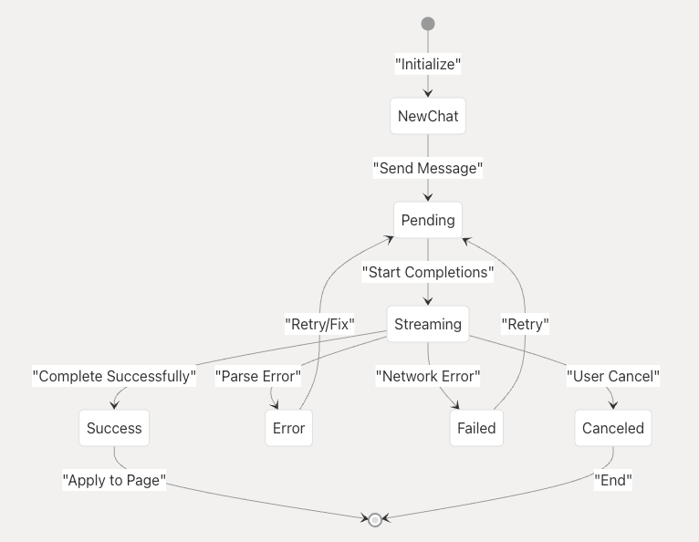

# AI 集成架构

本文档详细介绍了 VTJ 平台中 AI 驱动的代码生成与设计辅助功能。AI 子系统与 VTJ 核心引擎深度集成，支持通过自然语言提示、图像上传和元数据文件生成 Vue 组件和页面。有关底层处理机制，请参阅**核心架构文档**；关于可视化设计实现，请参考**设计器与渲染器文档**。

## AI 系统架构

VTJ 的 AI 集成采用分层架构设计，各层协同工作实现用户输入到可执行 Vue 代码的转换：



**AI 集成架构层次：**

1. **接口层**：负责收集用户输入（文本、图像、JSON）
2. **逻辑控制层**：管理状态机、API 通信和错误处理
3. **AI 处理层**：执行自然语言理解、图像识别和代码生成
4. **引擎集成层**：将生成的代码与 VTJ 核心引擎对接

## AI 输入处理机制

VTJ 支持三种输入模式，每种模式针对不同的开发场景：

| 输入类型     | 前端组件   | 支持格式          | 典型应用场景              |
| ------------ | ---------- | ----------------- | ------------------------- |
| 自然语言文本 | ChatInput  | 纯文本            | 功能需求描述、代码优化    |
| 设计图像     | ImageInput | .png, .jpg, .jpeg | 界面原型、设计稿转代码    |
| 结构化元数据 | JsonInput  | .json             | Figma/Sketch 设计文件导出 |

### 文本输入处理流程

文本输入通过 AISendData 接口处理自然语言提示，处理流程如下：


**处理流程：**

1. 提取当前项目上下文（包括 DSL 定义和 Vue 源码）
2. 构建包含完整上下文的提示词
3. 通过 AI 模型生成 Vue SFC 代码
4. 解析并验证生成代码的有效性

### 图像输入处理流程

图像处理管线将视觉设计转换为语义化的 Vue 组件：


**转换流程：**

1. 图像预处理（尺寸归一化、特征增强）
2. 基于 CV 模型识别 UI 元素和布局结构
3. 生成组件层次结构和样式定义
4. 输出符合 VTJ DSL 规范的中间表示

## AI 聊天系统与实时流处理

AI 聊天系统通过状态机管理对话交互，支持实时响应流：



**状态机关键状态：**

- `INITIAL`: 等待用户输入
- `STREAMING`: 处理 AI 流式响应
- `COMPLETED`: 生成最终代码结果
- `ERROR`: 处理异常情况

### 实时流式响应实现

使用 Server-Sent Events (SSE) 实现低延迟响应传输：

```ts
// 聊天补全核心逻辑
const chatCompletions = async (
  topicId: string,
  chatId: string,
  callback?: (data: any, done?: boolean) => void,
  error?: (err: any, cancel?: boolean) => void
) => {
  const controller = new AbortController();

  try {
    // 建立 SSE 连接
    const response = await fetch(API_ENDPOINT, {
      method: 'POST',
      signal: controller.signal,
      headers: { 'Content-Type': 'application/json' },
      body: JSON.stringify({ topicId, chatId })
    });

    // 处理流式数据块
    const reader = response.body.getReader();
    const decoder = new TextDecoder();
    let buffer = '';

    while (true) {
      const { value, done } = await reader.read();
      if (done) break;

      buffer += decoder.decode(value, { stream: true });
      const lines = buffer.split('\n');

      for (const line of lines) {
        if (line.startsWith('data:')) {
          const data = JSON.parse(line.substring(5));
          callback(data, false);
        }
      }
    }

    callback(null, true); // 流处理完成
  } catch (err) {
    error(err, true); // 错误处理
  }
};
```

## 代码生成与 DSL 集成

AI 系统通过双向转换管道与 VTJ 核心引擎集成：


**集成工作流：**

1. 从 AI 响应中提取 Vue SFC 代码
2. 将 Vue 代码转换为 DSL 中间表示
3. 应用变更到当前块模型
4. 通过渲染引擎更新 UI

### 代码转换关键函数

| 函数       | 功能描述                  | 输入         | 输出             |
| ---------- | ------------------------- | ------------ | ---------------- |
| getVueCode | 从 Markdown 提取 Vue 代码 | AI 响应文本  | Vue SFC 代码     |
| vue2Dsl    | Vue SFC 转 DSL 表示       | Vue SFC 代码 | 块架构定义       |
| applyAI    | 应用变更到引擎            | 块架构定义   | 更新后的 UI 状态 |

转换过程包含严格验证：

1. 组件命名符合 PascalCase 规范
2. 属性类型与值匹配验证
3. 样式作用域隔离检查
4. 依赖项完整性校验

## 主题管理与对话上下文

AI 系统通过主题机制管理对话上下文：


**数据模型关系：**

- 每个 `BlockModel` 关联多个 `Topic`
- 每个 `Topic` 包含多个 `Chat` 对话
- 每个 `Chat` 包含多条 `Message` 记录

### 主题生命周期管理

1. **主题创建**  
   通过 `onPostTopic` 创建新主题，关联项目上下文
2. **对话管理**  
   `onPostChat` 向主题添加消息，维护完整对话历史
3. **上下文加载**  
   根据 BlockModel 状态动态加载关联主题
4. **资源清理**  
   `onRemoveTopic` 级联删除主题及关联对话

## 用户体验增强功能

### 自动应用机制

启用后，系统自动应用验证通过的生成代码：

```ts
// 自动应用逻辑
function handleAutoApply(generatedCode) {
  if (config.autoApplyEnabled) {
    const dsl = vue2Dsl(generatedCode);
    if (validateDSL(dsl)) {
      engine.applyDSL(dsl);
    }
  }
}
```

### 交互式代码审查

提供多维度代码审查界面：

- **源码编辑器**：支持直接修改生成的 Vue 代码
- **DSL 预览面板**：实时显示转换后的 DSL 结构
- **版本比对**：对比不同生成版本的代码差异
- **手动应用控制**：选择性应用审查后的代码

### 错误恢复机制

全面错误处理框架：

| 错误类型     | 处理机制              | 恢复策略                   |
| ------------ | --------------------- | -------------------------- |
| 语法解析错误 | vue2Dsl 异常捕获      | 高亮错误位置，提供修复建议 |
| 网络通信异常 | 请求超时/中断处理     | 自动重试机制（最多3次）    |
| 验证错误     | DSL 模式校验          | 过滤无效节点，保留有效部分 |
| 用户取消操作 | onCancelChat 事件处理 | 清理中间状态，释放资源     |

错误处理系统提供上下文感知的恢复建议，支持用户迭代优化 AI 生成的代码。
