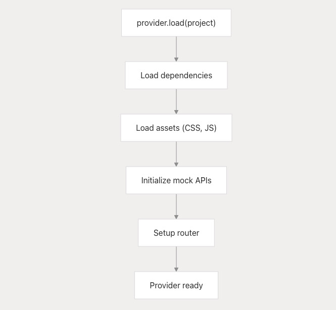
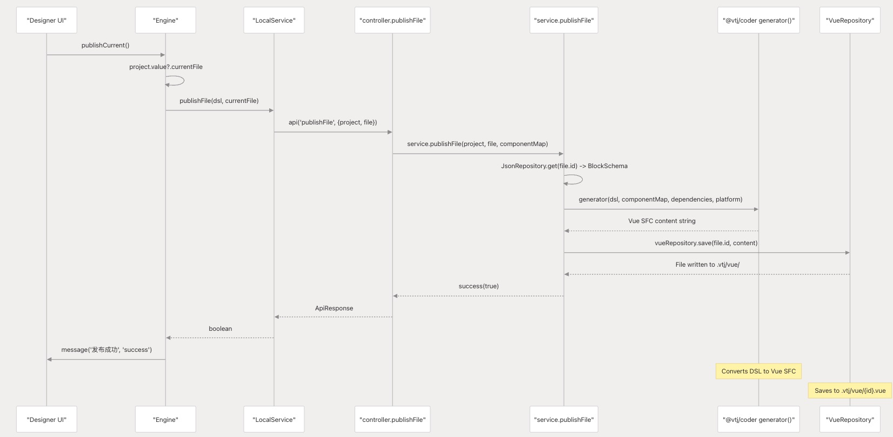

# 引擎、提供者与服务

本文档详细介绍了 VTJ 低代码平台架构的核心组件：引擎、提供者（Provider）和服务层（Service Layer）。这三个组件构成了平台在可视化设计和 Vue 源代码之间进行双向转换的基础架构，统一管理设计时环境和运行时环境。有关这些组件处理的数据模型细节，请参阅**工程模型**和**区块模型**

## 核心架构模式

VTJ 平台采用引擎-提供者-服务（Engine-Provider-Service）模式，实现设计时环境、运行时环境和后端服务的关注点分离。

**VTJ 核心架构：引擎-提供者-服务模式**


## 引擎（Engine）

引擎是设计时环境的核心控制器，负责工程模型管理、模块编辑和画布渲染仿真。

### 引擎属性与初始化

`Engine` 类通过以下关键属性管理完整的设计时状态：

| 属性      | 类型                | 描述                              |
| --------- | ------------------- | --------------------------------- |
| service   | Service             | 后端服务接口（文件操作/代码生成） |
| provider  | Provider            | 运行时渲染提供者                  |
| simulator | Simulator           | 画布渲染仿真器                    |
| project   | `Ref<ProjectModel>` | 当前加载的工程模型                |
| current   | `Ref<BlockModel>`   | 当前编辑的区块模型                |
| access    | Access              | 身份验证与权限控制模块            |
| history   | `Ref<HistoryModel>` | 撤销/重做历史记录堆栈             |

```ts
// 引擎初始化
const engine = new Engine({
  container: containerElement, // UI容器元素
  service: localService, // 后端服务实例
  materialPath: '/', // 物料资源基础路径
  adapter: adapterInstance, // 运行时适配器
  remote: 'https://lcdp.vtj.pro' // 远程服务器地址
});
```

### 引擎生命周期事件

引擎通过事件发射器绑定关键生命周期事件：

```ts
// 核心事件监听
emitter.on(EVENT_PROJECT_CHANGE, (e) => this.saveProject(e)); // 工程变更
emitter.on(EVENT_BLOCK_CHANGE, (e) => this.changeFile(e)); // 区块变更
emitter.on(EVENT_NODE_CHANGE, () => this.changeCurrentFile()); // 节点变更
emitter.on(EVENT_PROJECT_PUBLISH, () => this.publish()); // 工程发布
emitter.on(EVENT_PROJECT_FILE_PUBLISH, () => this.publishCurrent()); // 当前文件发布
```

### 初始化流程


## 提供者（Provider）

提供者作为设计时模型与运行时环境的桥梁，负责依赖加载、物料管理和渲染上下文提供。

### 提供者属性与初始化

| 属性       | 类型                     | 描述                              |
| ---------- | ------------------------ | --------------------------------- |
| mode       | ContextMode              | 运行模式（Design/Raw/Runtime）    |
| service    | Service                  | 后端服务接口                      |
| project    | ProjectSchema            | 加载的工程架构                    |
| library    | Record<string, any>      | 已加载的库依赖（Vue/VueRouter等） |
| components | Record<string, any>      | 注册的组件定义                    |
| apis       | Record<string, Function> | 平台API函数集合                   |

```ts
// 提供者初始化
const { provider, onReady } = createProvider({
  mode: ContextMode.Runtime, // 运行模式
  service: localService, // 后端服务实例
  materialPath: '/materials', // 物料资源路径
  dependencies: {
    // 前端依赖库
    Vue: () => import('vue'),
    VueRouter: () => import('vue-router')
  }
});
```

### 上下文模式说明

| 模式    | 使用场景        | 特性                            |
| ------- | --------------- | ------------------------------- |
| Design  | 设计时环境      | 支持节点选择/属性编辑等设计操作 |
| Runtime | 预览/运行时环境 | 完整交互功能，无设计控件        |
| Raw     | 纯渲染模式      | 无平台依赖，最小化运行时        |

### 资源加载流程

Provider 通过 `load` 方法按需加载工程依赖和资源：


### 渲染能力

提供者支持从DSL架构创建渲染器实例：

```ts
// 根据文件ID获取渲染组件
const component = await provider.getRenderComponent('pageId');

// 从DSL架构创建渲染器
const { renderer, context } = provider.createDslRenderer(dslSchema);
```

## 服务层（Service Layer）

服务层抽象后端操作接口，涵盖工程数据管理、文件操作和代码生成等核心能力，采用分层架构设计。

### 服务接口架构

#### 核心服务契约

`Service` 抽象类定义后端操作接口规范：

| 能力类别 | 关键方法                               | 功能说明                |
| -------- | -------------------------------------- | ----------------------- |
| 配置管理 | getExtension(), init()                 | 工程初始化与扩展配置    |
| 工程管理 | saveProject(), saveMaterials()         | 工程元数据保存          |
| 文件操作 | saveFile(), getFile(), removeFile()    | 区块/页面文件CRUD操作   |
| 历史管理 | saveHistory(), getHistoryItem()        | 撤销/重做历史记录管理   |
| 代码生成 | publish(), genVueContent(), parseVue() | 双向代码转换（DSL⇄Vue） |
| 资产管理 | uploadStaticFile(), getStaticFiles()   | 静态资源上传/管理       |

#### 服务层架构


### LocalService实现

`LocalService` 通过API控制器与本地开发服务器通信：

```mermaid
sequenceDiagram
  participant L as LocalService
  participant A as API Controller
  participant S as Service
  participant R as Repository
  L->>A: POST /__vtj__/api/init.json
  A->>S: controller.init(req, opts)
  S->>R: JsonRepository.get(projectId)
  R-->>S: ProjectSchema
  S-->>A: Response
  A-->>L: Result
```

#### 操作映射表

| LocalService方法 | HTTP方法 | API端点           | 控制器方法             | 存储库操作                      |
| ---------------- | -------- | ----------------- | ---------------------- | ------------------------------- |
| init()           | POST     | /init.json        | controller.init        | JsonRepository.get()            |
| saveProject()    | POST     | /saveProject.json | controller.saveProject | JsonRepository.save()           |
| saveFile()       | POST     | /saveFile.json    | controller.saveFile    | JsonRepository.save()           |
| publish()        | POST     | /publish.json     | controller.publish     | VueRepository.save() + 代码生成 |

### 存储库层实现

存储库层为不同数据类型提供持久化方案：

| 存储库类型       | 存储位置                    | 数据类型            | 核心能力                  |
| ---------------- | --------------------------- | ------------------- | ------------------------- |
| JsonRepository   | .vtj/projects/, .vtj/files/ | 工程元数据/区块架构 | 工程配置的版本化管理      |
| VueRepository    | .vtj/vue/                   | 生成的Vue单文件组件 | 源码版本控制/差异化对比   |
| StaticRepository | public/static/              | 图片/CSS等静态资源  | CDN上传/资源指纹管理      |
| PluginRepository | package.json                | 平台插件配置        | 插件依赖解析/生命周期管理 |
| UniRepository    | src/                        | Uni-app工程配置     | 跨平台适配（小程序/H5）   |

### 请求处理流程


## 组件间数据流

### 设计时→运行时流程


1. 用户通过设计器修改区块属性
2. 引擎生成更新的DSL架构
3. 提供者重新创建渲染上下文
4. 仿真器更新画布渲染

### 代码生成流程



1. 用户触发发布操作
2. 服务层执行代码生成
3. Vue SFC文件写入存储库
4. 生成可部署的前端工程

## 集成示例

### 运行时环境集成

```ts
// 创建运行时提供者
const { provider, onReady } = createProvider({
  mode: ContextMode.Runtime,
  service: new LocalService(createServiceRequest(notify)),
  adapter: createAdapter({
    // 平台能力适配器
    loading, // 加载状态管理
    notify, // 通知系统
    useTitle, // 页面标题管理
    alert // 弹窗系统
  }),
  dependencies: {
    // 按需加载的依赖
    Vue: () => import('vue'),
    VueRouter: () => import('vue-router')
  }
});

// 提供者就绪后渲染组件
onReady(async () => {
  app.use(provider); // 注册提供者到Vue实例

  // 获取页面渲染组件
  renderer.value = await provider.getRenderComponent(
    route.params.id.toString(),
    (file) => setupPageSetting(app, route, file) // 页面配置初始化
  );
});
```

### 设计环境集成

```ts
// 创建设计时引擎
const engine = new Engine({
  container, // 画布容器
  service, // 后端服务实例
  materialPath: __BASE_PATH__, // 物料基准路径
  pageBasePath: base === '/' ? '' : base, // 页面基础路径
  adapter, // 运行时适配器
  access: __ACCESS__, // 权限控制模块
  remote, // 远程服务器配置
  auth, // 认证模块
  checkVersion // 版本检查
});

// 引擎就绪后打开文件
engine.ready(() => {
  engine.openFile(route.query.id as string); // 通过URL参数打开指定文件
});
```

## 服务层集成模式

### 运行时服务集成


> **关键点**：运行时环境通过轻量级服务代理与后端交互，避免直接依赖平台内部模块

### 访问控制集成


> **权限控制链**：UI层 → 引擎Access模块 → 服务层 → 存储库层

## 总结

引擎、提供者与服务层构成VTJ低代码平台的架构基石：

- **引擎(Engine)**：设计时环境核心，管理工程状态和编辑生命周期
- **提供者(Provider)**：连接设计与运行的桥梁，负责上下文创建和渲染管理
- **服务层(Service)**：抽象后端操作，支持多存储方案和代码生成

三者协同实现可视化设计与可运行代码间的双向转换工作流，这是VTJ平台的核心价值所在。

:::info 说明
本文档内容由AI辅助翻译，可能存在术语差异或细节遗漏，请以[英文原版](https://deepwiki.com/ChenXiaohui99/vtj/2.1-engine-provider-and-service-layer)为准
:::
