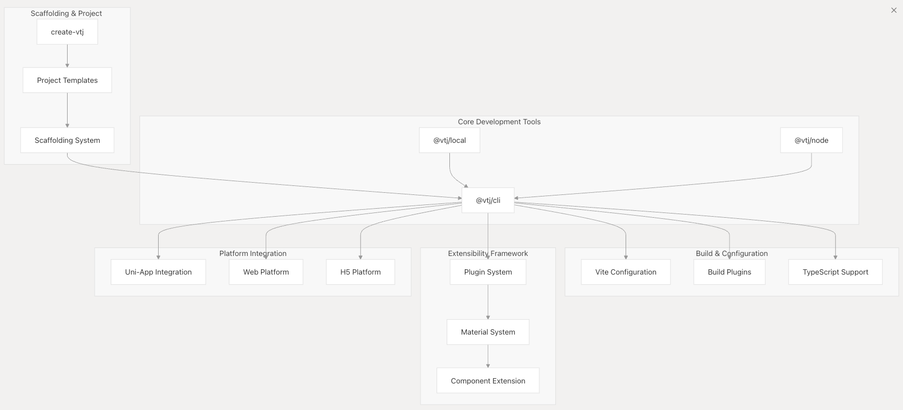
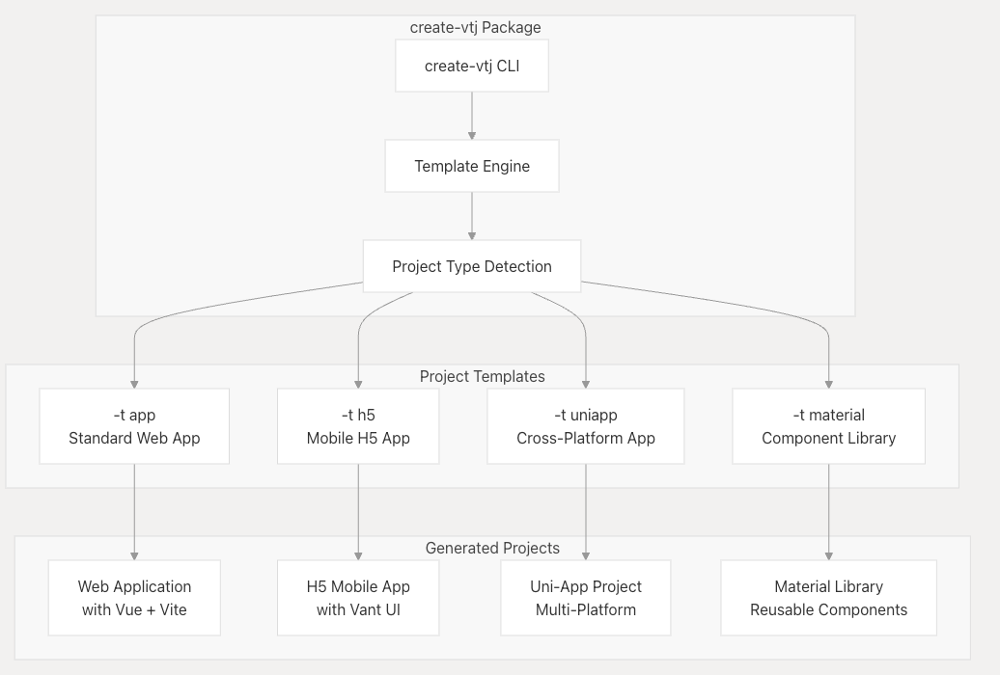
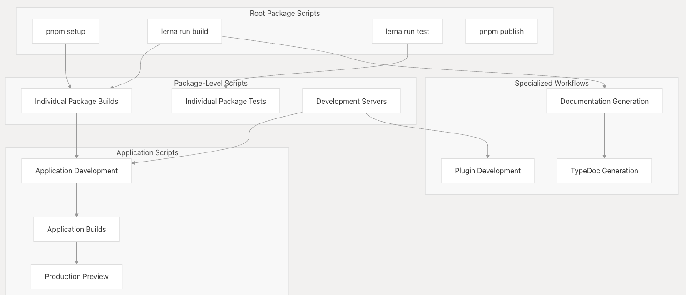

# 开发人员工具与可扩展性

VTJ 平台提供了一套全面的开发工具和可扩展性框架，旨在支持低代码应用程序的开发、构建和扩展。本文档概述了关键的工具基础设施、脚手架系统和插件架构，使开发人员能够高效使用和扩展 VTJ 平台。

VTJ 开发者工具生态系统由多个互联系统组成：

- **CLI 与构建系统**：命令行工具和构建配置
- **插件系统**：自定义组件的扩展性框架
- **Uni-App 集成**：跨平台开发支持

## 概述

VTJ 开发者工具生态系统围绕多个专用软件包构建，这些包协同工作以提供完整的开发体验。这些工具与现代前端技术（如 Vite、TypeScript 和 Vue）集成，为平台开发和扩展创建了优化的工作流。

**VTJ 开发者工具生态系统**



## 核心开发工具

VTJ 生态系统包含多个提供开发工具和基础设施的核心软件包：

**核心开发包**


### 关键工具功能

| 包         | 主要功能                  | 主要导出项                                                       |
| ---------- | ------------------------- | ---------------------------------------------------------------- |
| @vtj/cli   | 构建工具和开发服务器      | createViteConfig、createUniappViteConfig、createPluginViteConfig |
| @vtj/local | 带API代理的本地开发服务器 | 开发服务器、文件操作、代码生成                                   |
| @vtj/node  | Node.js工具实用程序       | 文件系统实用程序、HTTP客户端、项目操作                           |
| create-vtj | 项目脚手架系统            | 基于模板创建不同平台的项目                                       |

## 项目脚手架系统

VTJ 平台通过 `create-vtj` 包提供完善的项目脚手架系统，为不同类型的 VTJ 应用程序提供基于模板的项目创建方案。

**脚手架架构**



### 可用项目模板

| 模板     | 参数        | 生成的项目类型         | 主要特性                        |
| -------- | ----------- | ---------------------- | ------------------------------- |
| 应用程序 | -t app      | 标准 Vue Web 应用程序  | Vue 路由器、Pinia、Element Plus |
| H5       | -t h5       | 移动优先的 H5 应用程序 | Vant UI，移动端优化             |
| UniApp   | -t uniapp   | 跨平台应用程序         | 多平台部署，Uni-UI              |
| 物料库   | -t material | 组件库                 | 插件系统，可复用组件            |

## 插件开发框架

VTJ 提供全面的插件开发框架，允许开发者为低代码平台创建自定义组件、物料和扩展。

**插件系统架构**


### 插件配置结构

插件通过 `package.json` 中的 `vtj.plugins` 部分进行配置：

```json
// package.json 中的插件配置示例
{
  "vtj": {
    "plugins": [
      {
        "id": "v-test", // 唯一插件标识符
        "name": "VTest", // 注册的组件名称
        "library": "VTest", // 库导出名称
        "title": "测试", // 设计器中的显示标题
        "urls": "xxx.json,xxx.css,xxx.js" // 附加资源
      }
    ]
  }
}
```

## 本地开发基础设施

VTJ 平台包含专为本地开发设计的工具，包括具备 API 代理功能和文件操作实用程序的开发服务器。

**本地开发架构**


### 开发服务器功能

| 功能     | 包         | 依赖项                  | 目的                    |
| -------- | ---------- | ----------------------- | ----------------------- |
| 文件上传 | @vtj/local | formidable              | 处理开发中的文件上传    |
| 代码生成 | @vtj/local | @vtj/coder、@vtj/parser | 生成和解析 Vue SFC 文件 |
| API 代理 | @vtj/local | @vtj/node               | 开发期间代理 API 请求   |
| 文件操作 | @vtj/node  | FS-extra、Axios         | 文件系统和 HTTP 操作    |

## 可扩展性框架

VTJ 为开发者提供多个扩展点，用于自定义和扩展平台功能。

**扩展点与集成**


### 扩展开发工作流

| 扩展类型     | 基础包         | 关键依赖项                   | 构建输出         |
| ------------ | -------------- | ---------------------------- | ---------------- |
| 物料组件     | @vtj/materials | Element Plus、Ant Design Vue | 含元数据的组件库 |
| 设计器插件   | @vtj/designer  | Monaco 编辑器、highlight.js  | 设计时功能       |
| 自定义渲染器 | @vtj/renderer  | @vtj/core、@vtj/utils        | 运行时渲染逻辑   |
| 构建插件     | @vtj/cli       | Vite、Rollup 插件            | 开发工具         |

## 开发工作流集成

VTJ 开发者工具与现代开发工作流无缝集成，通过 npm 脚本和命令行实用程序提供全面的自动化支持。

**Monorepo 开发工作流**



### 关键开发命令

| 命令类别   | 示例命令                            | 目的                 |
| ---------- | ----------------------------------- | -------------------- |
| 设置与维护 | pnpm setup、pnpm reset、pnpm clean  | 环境初始化           |
| 构建       | npm run build、lerna run build      | 编译所有软件包       |
| 测试       | npm run test、npm run coverage      | 运行测试并生成覆盖率 |
| 开发       | npm run dev、npm run pro:dev        | 启动开发服务器       |
| 文档       | npm run docs:build、npm run typedoc | 生成文档             |

## 开发工作流命令

VTJ CLI 支持通过项目 package.json 中的命令简化开发工作流：

| 命令        | 描述           |
| ----------- | -------------- |
| vtj dev     | 启动开发服务器 |
| vtj build   | 构建生产版本   |
| vtj preview | 预览生产版本   |
| vtj test    | 运行单元测试   |
| vtj clean   | 清理构建产物   |

## 结论

VTJ 开发者工具提供了一套全面的实用程序，用于构建、测试和部署各类低代码应用程序。通过利用 Vite、TypeScript 和 Vue 等现代前端工具，VTJ CLI 创建了强大而灵活的开发环境。

对于需要扩展 VTJ 本身功能的项目，开发者工具支持使用专用构建配置和集成点进行插件开发。
