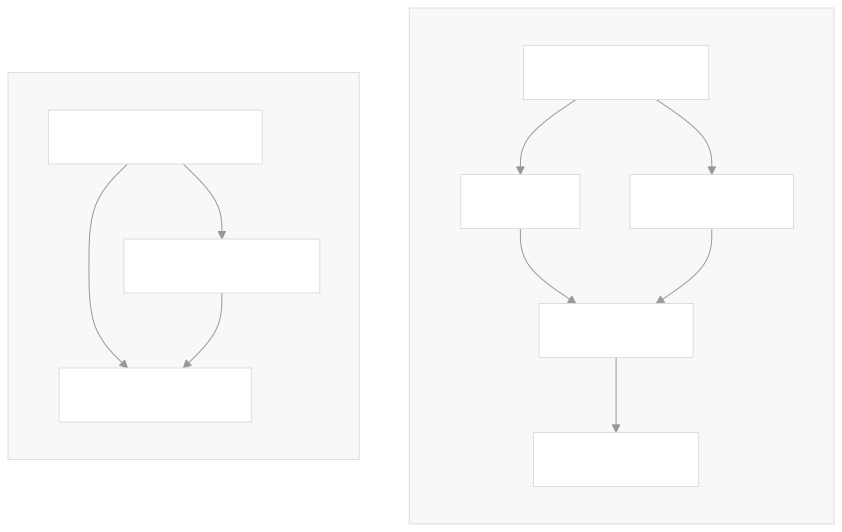

# VTJ.PRO 概述

VTJ.PRO 是一个 AI 驱动的 Vue3 低代码开发平台，支持 Vue 单文件组件(SFC)与领域特定语言(DSL)之间的双向转换。基于具有同步版本控制的 monorepo 架构，VTJ 提供了完整的软件包生态系统，包含可视化设计器、代码生成引擎和多平台部署能力，同时保持与标准 Vue 3 开发工作流的兼容性。

## 目的与范围

本文档概述了 VTJ 低代码平台的整体架构、核心组件和设计理念，涵盖以下关键方面：

- **核心架构**：引擎协调层、服务提供者系统和数据模型
- **开发工作流**：双向代码转换、AI 增强开发
- **多平台支持**：Web、H5 和 UniApp 部署方案
- **扩展能力**：插件系统和开发者工具

## 核心特性

- **双向代码转换**：实现可视化设计与 Vue 源代码之间的无缝双向转换
- **AI 增强开发**：集成智能代码生成、性能优化及图像到代码转换功能
- **Vue 3 基础架构**：基于最新 Vue 生态系统，全面支持 TypeScript 和 Vite
- **多平台适配**：针对 Web 应用、移动 H5 应用和 UniApp 跨平台项目优化
- **渐进式集成**：专为 Vue 开发者设计，支持逐步集成到现有项目
- **非侵入式设计**：与现有代码库无缝集成，无运行时污染

## 系统架构概述

VTJ 采用分层模块化架构，通过清晰的关注点分离实现高内聚低耦合：



## Monorepo 包结构

VTJ 使用 monorepo 管理多个相互依赖的独立包，确保版本同步和高效协作：


## 项目脚手架系统

create-vtj 提供标准化项目初始化流程，支持多种项目类型：


## AI 增强的设计-开发工作流

VTJ 通过 AI 技术增强 Vue SFC 与低代码 DSL 之间的双向转换：

### 双向代码转换管道


### 数据结构转换流程

1. **设计时模型**：可视化编辑生成 DSL 表示
2. **代码生成**：将 DSL 转换为 Vue SFC
3. **AI 优化**：应用 AI 建议改进代码质量和性能
4. **逆向工程**：将修改后的代码同步回设计时模型

## AI 驱动的开发能力

VTJ 将 AI 功能深度集成到整个开发流程中：

### AI 集成架构


**关键 AI 功能：**

- 自然语言转代码：将需求描述转换为可执行组件
- 设计稿识别：将 UI 设计图像转换为 Vue 组件
- 代码优化建议：识别性能瓶颈并提供优化方案
- 错误预测与修复：提前检测潜在错误并提供修复方案

## 快速开始

### 使用 create-vtj 创建项目

通过以下命令创建不同类型的 VTJ 项目：

```shell
# Web 应用程序(PC) - 使用 @vtj/web 平台
npm create vtj@latest --registry=https://registry.npmmirror.com -- -t app

# 移动 H5 应用程序 - 使用 @vtj/h5 平台
npm create vtj@latest --registry=https://registry.npmmirror.com -- -t h5

# 跨平台应用 - 使用 @vtj/uni-app 平台
npm create vtj@latest --registry=https://registry.npmmirror.com -- -t uniapp

# 组件开发 - 使用 @vtj/materials 平台
npm create vtj@latest --registry=https://registry.npmmirror.com -- -t material
```

### 开发环境配置

配置本地开发环境的完整流程：

```shell
git clone https://gitee.com/newgateway/vtj.git
cd vtj
npm run setup   # 安装依赖并初始化项目
npm run build   # 构建所有包
npm run app:dev # 启动开发服务器
```

### 与现有项目集成

VTJ 通过平台适配器包与现有 Vue 3 项目集成：

1. 安装对应平台包：`npm install @vtj/web`
2. 在入口文件中注册 VTJ 插件
3. 配置构建工具（Vite/Webpack）集成
4. 逐步迁移组件到可视化设计环境

## 多平台部署架构

VTJ 通过专用平台包支持不同部署目标：

| 平台    | 包           | 目标环境                       | 核心依赖                                   |
| ------- | ------------ | ------------------------------ | ------------------------------------------ |
| Web     | @vtj/web     | 桌面 Web 应用                  | element-plus, @vtj/core, @vtj/renderer     |
| 设计器  | @vtj/pro     | 可视化设计平台                 | @vtj/renderer, @vtj/local, @vtj/materials  |
| 移动 H5 | @vtj/h5      | 移动端 Web 应用                | vant, @vtj/core, @vtj/renderer             |
| UniApp  | @vtj/uni-app | 跨平台应用(小程序/iOS/Android) | @dcloudio/uni-app, @vtj/uni, @vtj/renderer |

### 平台运行时架构


## 当前版本

VTJ 当前稳定版本为 v0.12.47，所有 monorepo 包保持版本同步。每个版本包含：

- 核心引擎更新
- AI 模型优化
- 平台适配改进
- 开发者工具增强

## 总结

VTJ.PRO 是为 Vue 3 开发者设计的企业级低代码平台，通过可视化设计与源代码之间的双向转换，在保持开发灵活性的同时提升效率。其模块化架构、AI 增强工作流和多平台支持，使其适用于从简单原型到复杂企业应用的开发场景。
