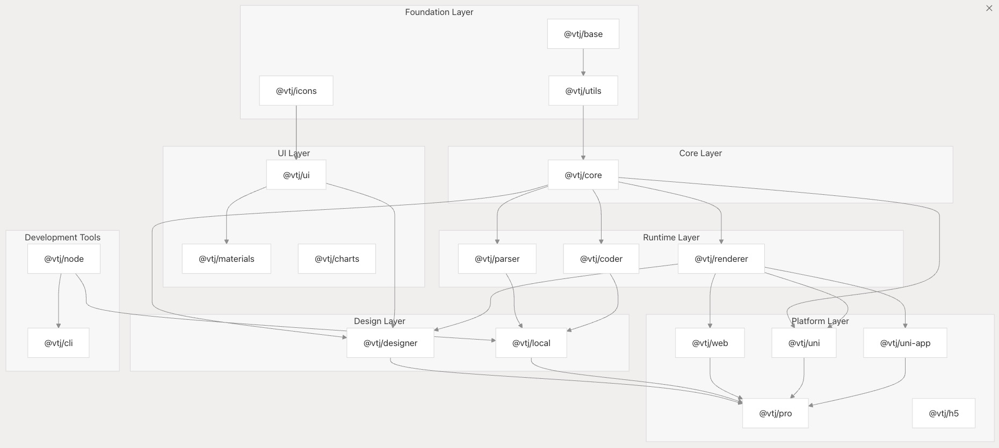

# 包结构与 Monorepo

本文档概述了 VTJ 低代码平台的 monorepo 结构、软件包依赖关系和构建系统组织。它详细说明了包的架构方式、相互依赖关系以及支持开发和部署的构建系统。关于核心架构组件的详细信息，请参阅**核心架构**文档。

## Monorepo 结构概述

VTJ 平台采用 PNPM 工作区和 Lerna 进行包管理，以 monorepo 形式组织。代码库包含多个逻辑分层的包，通过 `workspace:~` 引用管理工作区依赖项。这种 monorepo 结构支持跨所有包的同步版本控制、共享工具和协调发布。



## 软件包功能与用途

VTJ 平台包含以下核心软件包：

| 包名           | 版本    | 功能描述                    | 主要依赖                                                            |
| -------------- | ------- | --------------------------- | ------------------------------------------------------------------- |
| @vtj/base      | 0.12.40 | 基础类型定义和核心工具      | reflect-metadata, crypto-js, dayjs, lodash-es                       |
| @vtj/utils     | 0.12.40 | 通用工具函数和辅助方法      | @vtj/base, axios, js-cookie                                         |
| @vtj/core      | 0.12.40 | 核心数据模型和引擎抽象      | @vtj/base                                                           |
| @vtj/icons     | 0.12.40 | 平台图标组件库              | @element-plus/icons-vue                                             |
| @vtj/ui        | 0.12.40 | UI 组件库                   | @vtj/icons, @vtj/utils, element-plus, sortablejs, vxe-table         |
| @vtj/materials | 0.12.40 | 设计器使用的组件物料库      | @vtj/core, @vtj/ui, @vtj/utils, element-plus, ant-design-vue, vant  |
| @vtj/charts    | 0.12.40 | 数据可视化图表组件          | @vtj/icons, @vtj/utils, echarts                                     |
| @vtj/renderer  | 0.12.40 | 低代码 DSL 运行时渲染器     | @vtj/core, @vtj/utils                                               |
| @vtj/parser    | 0.12.40 | Vue 代码到 DSL 模型的转换器 | @vtj/base, @vtj/core, @babel/parser, @vue/compiler-sfc              |
| @vtj/coder     | 0.12.40 | DSL 模型到 Vue 代码的生成器 | @vtj/base, @vtj/core, prettier                                      |
| @vtj/designer  | 0.12.40 | 可视化设计环境              | @vtj/core, @vtj/renderer, @vtj/ui, monaco-editor                    |
| @vtj/local     | 0.12.40 | 本地开发服务                | @vtj/coder, @vtj/core, @vtj/node, @vtj/parser                       |
| @vtj/pro       | 0.12.40 | 集成 IDE 的专业平台         | @vtj/core, @vtj/designer, @vtj/local, @vtj/materials, @vtj/renderer |
| @vtj/web       | 0.12.40 | Web 平台实现                | @vtj/charts, @vtj/core, @vtj/renderer, @vtj/ui                      |
| @vtj/uni       | 0.12.40 | UniApp 支持包               | @vtj/core, @vtj/renderer, @vtj/utils                                |
| @vtj/uni-app   | 0.12.40 | UniApp 平台实现             | @vtj/core, @vtj/renderer, @vtj/uni                                  |
| @vtj/cli       | 0.12.4  | 构建和开发工具              | vite, vue-tsc, @vitejs/plugin-vue, rollup plugins                   |
| @vtj/node      | 0.12.40 | Node.js 工具集              | @vtj/base, fs-extra, axios                                          |

## 包依赖关系


## 基础层：Core、Base 和 Utils

基础层为整个平台提供核心构建模块。

### @vtj/base

基础包提供以下核心功能：

- 类型定义系统
- 通用接口声明
- 基于 crypto-js 的加密工具
- 使用 dayjs 的日期处理工具
- Lodash 工具函数扩展

### @vtj/utils

工具包在基础包之上提供更专业的实用功能：

- 基于 axios 的 HTTP 请求封装
- Cookie 管理工具
- 浏览器存储抽象层
- 通用辅助函数集
- 路径匹配实用工具

### @vtj/core

核心包定义低代码平台的核心数据模型和抽象：

- 项目模型架构
- 模块(Block)模型
- 节点(Node)模型
- 状态管理机制
- 事件处理系统
- 数据绑定实现

此包是系统的概念核心，定义了支撑低代码体验的领域特定语言(DSL)。

## 运行时层：Renderer、Parser 和 Coder


### @vtj/renderer

渲染器包负责以下功能：

- 在运行时将 DSL 模型转换为 Vue 组件
- 管理组件状态(state)和属性(props)
- 处理事件流和数据绑定
- 支持动态插槽渲染
- 提供组件通信上下文

### @vtj/parser

解析器包提供以下能力：

- 将 Vue 单文件组件(SFC)转换为 DSL 模型
- 使用 Babel 进行 AST 遍历和分析
- CSS 解析和样式提取
- 使用 Vue 编译器解析模板结构

### @vtj/coder

代码生成器包处理：

- 从 DSL 模型生成 Vue 源代码
- 使用 Prettier 进行代码格式化
- 模板代码生成
- 脚本和样式代码生成

## 设计层：Designer 和本地服务

设计层提供可视化设计环境和本地开发能力。

### @vtj/designer

设计器包包含：

- 画布和属性面板组件
- 组件拖放功能实现
- 基于 Monaco Editor 的代码编辑器
- 组件树导航系统
- 预览模拟环境
- AI 辅助集成接口

### @vtj/local

本地服务包提供：

- 本地文件系统集成
- 项目加载和保存机制
- 文件代码生成功能
- 本地开发服务器支持
- 文件上传处理

## 平台实现

VTJ 通过专用包支持多个平台目标：

### @vtj/web

Web 包提供标准的 Web 平台实现，包括：

- Web 专用组件
- Element Plus 集成
- 图表集成方案
- Web 运行时支持

### @vtj/pro

Pro 包提供完整的 IDE 体验，整合了：

- 设计器环境
- 本地开发服务
- 物料管理系统
- 运行时渲染器
- 平台集成接口

### @vtj/uni 和 @vtj/uni-app

这些包为 UniApp 开发提供支持：

- UniApp 组件映射系统
- H5 和小程序兼容支持
- UniApp 专用渲染方案
- 与 UniApp 框架的深度集成

## 开发工具

### @vtj/cli

CLI 包提供开发和构建工具：

- 项目脚手架生成
- 构建配置管理
- 开发服务器支持
- 测试实用工具
- 插件系统支持

### @vtj/node

Node 工具包提供：

- 文件系统操作工具
- 服务端 HTTP 工具
- 配置管理系统
- 项目模板处理

## Monorepo 管理与构建系统

### 工作区配置

VTJ monorepo 使用 PNPM 工作区和 Lerna 进行包管理。工作区配置定义在 pnpm-workspace.yaml 中，通过 `workspace:~` 说明符管理工作区依赖关系。

**PNPM 工作区结构：**


### 包版本控制策略

所有 VTJ 包遵循同步版本控制策略。当前主要版本为 0.12.40（CLI 为 0.12.4），通过根目录 package.json 中定义的 Lerna 命令进行统一管理。

**版本管理命令：**

- `lerna version patch --yes` - 补丁版本更新
- `lerna version minor --yes` - 次要版本更新
- `lerna version prerelease --yes` - 预发布版本更新
- `pnpm -r publish --access public` - 同步发布所有包

### 构建系统架构

构建系统使用通过 npm 脚本编排的工具链：

**主要构建工具：**

- Vite - 主构建工具
- Vue-tsc - Vue 组件的 TypeScript 编译
- Unbuild - Node.js 包的统一构建系统
- Rollup - 模块打包（使用插件扩展）
- Terser - JavaScript 代码压缩
- Sass - CSS 预处理

**构建流程编排：**


平台构建系统特点：

- 基于语义化版本控制的同步版本管理
- 使用 PNPM 工作区和 Lerna 的 monorepo 管理
- 跨所有包的协调构建流水线
- 自动化测试和覆盖率报告

## 应用集成方式

应用可通过多种方式集成 VTJ 包：

1. 使用完整的 Pro 平台体验：

```ts
import { createApp } from 'vue';
import { VtjPro } from '@vtj/pro';

const app = createApp(App);
app.use(VtjPro);
```

2. 仅使用 Web 渲染器：

```ts
import { createApp } from 'vue';
import { VtjWeb } from '@vtj/web';

const app = createApp(App);
app.use(VtjWeb);
```

3. 使用 UniApp 集成：

```ts
import { createSSRApp } from 'vue';
import { VtjUniApp } from '@vtj/uni-app';

export function createApp() {
  const app = createSSRApp(App);
  app.use(VtjUniApp);
  return { app };
}
```

## 应用示例

代码库包含多个示例应用：

| 应用名称  | 描述           | 使用包                         |
| --------- | -------------- | ------------------------------ |
| app       | 标准 Web 应用  | @vtj/web, @vtj/plugin-ckeditor |
| uniapp    | UniApp 实现    | @vtj/uni-app, @vtj/renderer    |
| h5        | 移动端 H5 应用 | @vtj/h5, @vtj/renderer         |
| extension | 浏览器扩展     | @vtj/pro, @vtj/web             |
| material  | 物料编辑器     | @vtj/pro, @vtj/web             |
| plugin    | 插件开发环境   | @vtj/pro, @vtj/web             |
| lcdp      | 在线演示平台   | @vtj/web, @vtj/pro             |

这些示例展示了 VTJ 支持的不同集成方法和平台目标。
